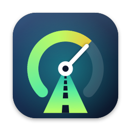
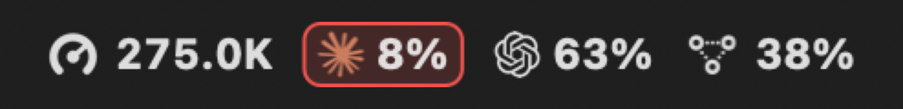
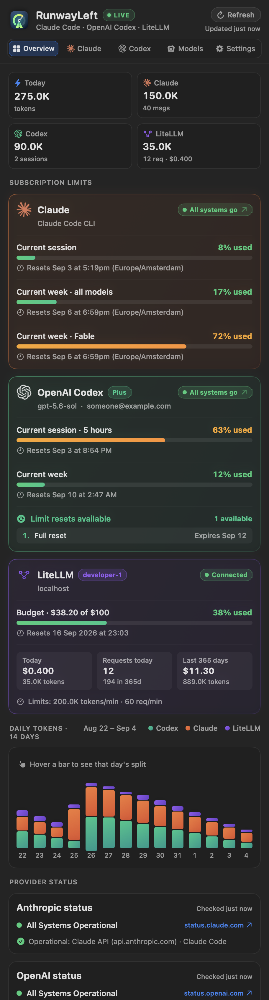
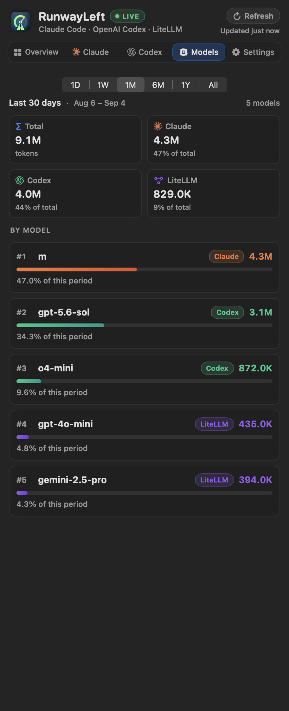
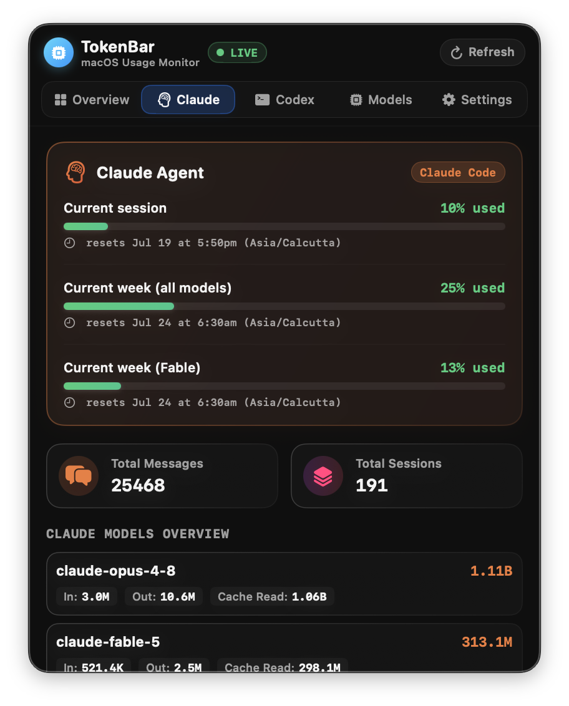
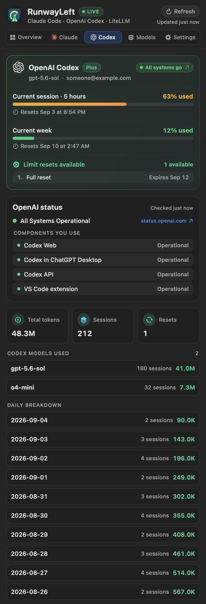
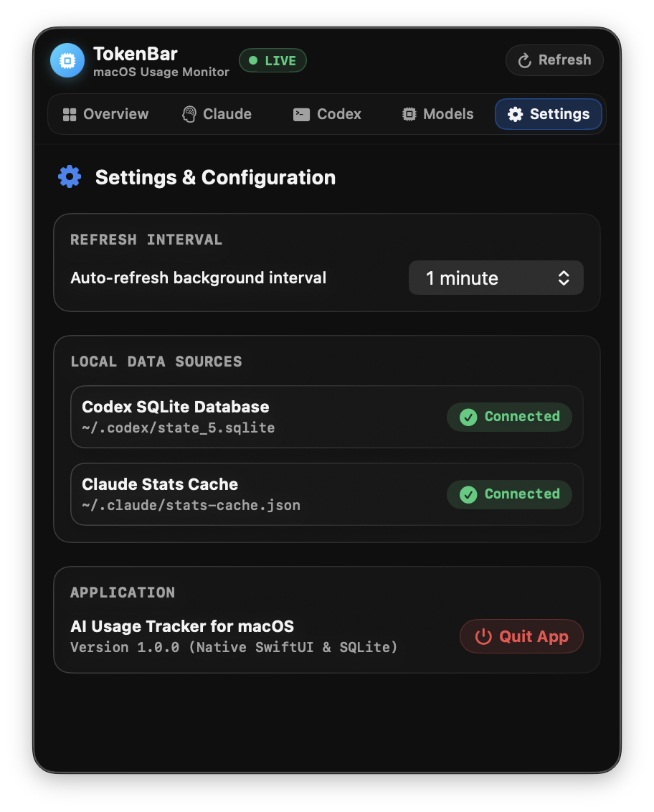

<p align="center">
  
</p>

<h1 align="center">RunwayLeft</h1>

<p align="center">
  <strong>How much runway is left on your AI coding subscriptions.</strong><br>
  A macOS menu bar app for Claude Code, OpenAI Codex, and LiteLLM.
</p>

<p align="center">
  
  
  
  
</p>

<p align="center">
  
</p>

Claude Code and Codex meter you on rolling windows: a five-hour session and a weekly allowance. The numbers live behind CLI commands and hidden files, and you usually find out you are near the ceiling when a request is refused. RunwayLeft puts the percentages in the menu bar, shows when each window resets, and tells you when the provider itself is having a bad day.

Everything is read from your own machine. The only network calls are the two public status pages and, if you configure it, your own LiteLLM proxy.

---

## At a glance

| Overview | Models |
| :---: | :---: |
|  |  |

| Claude | Codex |
| :---: | :---: |
|  |  |

<p align="center">
  
</p>

<sub>Screenshots are rendered from sample data by the test suite; see <a href="#development">Development</a>.</sub>

---

## Features

### Subscription limits

- **Claude Code.** Current session, weekly across all models, and the weekly model-specific limit, each with its reset time, exactly as `claude -p /usage` reports them. If the local session has expired, the card says so instead of showing zeros.
- **OpenAI Codex.** Both rate-limit windows, the 5-hour session and the 7-day allowance, plus your plan, the configured model, and any limit-reset credits with their expiry.
- **Reset times** are shown under every bar, so you know whether to wait ten minutes or three days.

### Menu bar

- Four display styles: icon only, today's tokens, quota percentages, or both.
- Choose which limit the percentage follows for each provider: session, weekly, model-specific, or the highest of them.
- Brand icons or plain "C" and "X" labels, and a per-provider show/hide toggle.
- When a provider's status page reports a problem, its metric gets an outline: orange for degraded, red for an outage.
- A live preview in Settings shows exactly what the menu bar will look like.
- Right-click (or Control-click) the item for a quick menu: Refresh Now, Open Overview, Settings, Launch at Login, and Quit.

### Provider status

- Polls `status.claude.com` and `status.openai.com` and shows a status pill on each card. The pill reflects the components you actually use (Claude Code and the Claude API; the Codex components and the VS Code extension), not just the page-wide banner.
- The Overview shows a compact status per provider that expands only when something is wrong. The Claude and Codex tabs list every affected component, open incidents with their latest update, and scheduled maintenance, each linking to the status page.
- Can be switched off in Settings.

### Usage over time

- **Today** strip: total tokens across providers, with the per-provider split.
- **Daily chart** of the last 14 days, stacked by provider, with a hover breakdown.
- **Models tab** with a time range selector (today, 7 days, 30 days, 6 months, 12 months, all time), per-provider totals for the period, and every model ranked by tokens.

### LiteLLM proxy (optional)

Point the app at your own LiteLLM proxy with a virtual key and it becomes a third provider: the key's spend against its budget as a runway bar, today's spend, tokens, and requests, a third series in the chart, and per-model usage in the Models tab. A three-stage **Test connection** button reports whether the proxy is reachable, the key is accepted, and spend tracking is available. See [Configure LiteLLM](#configure-litellm).

### Readable and resizable

- Three text sizes. The popover width grows with the text, so labels wrap instead of shrinking.
- The popover fits its content by default, up to your screen height. Drag the grip at the bottom edge or set a fixed height in Settings.
- Works in light and dark mode.

### Light on the battery

The first version of this app re-parsed every Claude transcript from the day once a minute and spawned the Claude CLI just as often. It now does neither.

| Work | When it runs |
| --- | --- |
| Local files (stats cache, Codex database) | Every refresh interval (1 to 30 minutes, or manual) |
| Today's Claude tokens from transcripts | Every refresh, but only the bytes appended since the last pass |
| `claude -p /usage` and `codex app-server` | At most every 5 minutes, or when you press Refresh |
| Status pages and LiteLLM | At most every 5 minutes, or when you press Refresh |

The refresh timer carries tolerance so macOS can coalesce wakeups, nothing animates while idle, and the menu bar image is redrawn only when its content changes.

### Private by default

- No accounts, no telemetry, no cloud sync.
- Claude and Codex data comes from local files and local CLIs.
- Network access is limited to the two status pages (read-only, no identifying data) and your own LiteLLM endpoint if you configure one.
- The LiteLLM key is stored as an owner-only file under `~/Library/Application Support/RunwayLeft/`, never in preferences.

---

## Data sources

| Provider | What | Where it comes from |
| --- | --- | --- |
| Claude Code | Session and weekly percentages, reset times | `claude -p /usage --output-format json` |
| Claude Code | Daily messages, sessions, tool calls, tokens per model | `~/.claude/stats-cache.json` |
| Claude Code | Today's live tokens and activity | `~/.claude/projects/**/*.jsonl`, scanned incrementally |
| Codex | 5-hour and 7-day windows, plan, reset credits | `codex app-server --stdio`, `account/rateLimits/read` |
| Codex | Fallback for any window the app-server did not report, if the logged window has not reset yet | Newest `~/.codex/sessions/*.jsonl` |
| Codex | Account email and plan, configured model | `~/.codex/auth.json`, `~/.codex/config.toml` |
| Codex | Sessions and tokens per day and per model | `~/.codex/state_5.sqlite` (read-only) |
| Anthropic, OpenAI | Service status, incidents, maintenance | `status.claude.com`, `status.openai.com` (`/api/v2/summary.json`) |
| LiteLLM | Key spend, budget, limits | `GET /key/info` |
| LiteLLM | Spend, tokens, requests per day and per model | `GET /user/daily/activity` (paged) |

---

## Install

### Requirements

- macOS 13 Ventura or later
- Xcode Command Line Tools with Swift 5.9 or later (to build)
- The `claude` CLI and/or the `codex` CLI, signed in

### Build and install

```bash
git clone https://github.com/edicorAi/runwayleft.git
cd runwayleft

swift test          # no network, about 20 seconds
./build_app.sh      # ad-hoc signed bundle at build/RunwayLeft.app

ditto "build/RunwayLeft.app" "/Applications/RunwayLeft.app"
open "/Applications/RunwayLeft.app"
```

The bundle is ad-hoc signed, not notarized. On first launch Gatekeeper may ask you to confirm; right-click the app and choose Open, or allow it under System Settings › Privacy & Security.

### Upgrading

Quit the running copy, copy the new bundle over the old one with `ditto`, and open it. Settings carry over. If you are coming from a build named "AI Usage Tracker", delete that one; its settings are migrated on first launch.

### Launch at login

Settings › Application › Launch at login. macOS may ask you to approve the login item under System Settings › General › Login Items.

---

## Configure LiteLLM

1. Open Settings › LiteLLM and turn on **Read metrics from a LiteLLM proxy**.
2. Enter the endpoint, for example `http://localhost:4000`, and a virtual key.
3. Press **Test connection**. It reports three stages:
   - **Reachable**: the proxy answers `/health/liveliness`.
   - **Authenticated**: `/key/info` accepts the key, and shows its alias, spend, and budget.
   - **Spend tracking**: `/user/daily/activity` returns data. This fails on a proxy without a database, which is common for quick installs; the card will say "No spend tracking" until one is configured.
4. A successful test fetches immediately. Afterwards the proxy is polled at most every five minutes, or when you press Refresh.

The menu bar shows the LiteLLM budget percentage only when the key has a `max_budget`. The Models tab treats "all time" for LiteLLM as the fetched window, the last 365 days.

---

## Troubleshooting

- **The menu bar icon is missing after installing.** On a full menu bar, new items land in the collapsed overflow zone behind the "«" chevron. Click the chevron, then Cmd-drag the RunwayLeft item to the right. This happens once.
- **"Local session expired" on the Claude card.** Run `claude` in a terminal and sign in again; the card recovers on the next refresh.
- **Codex shows "No snapshot recorded".** The `codex` binary was not found or the app-server did not answer, and no recent session log had a rate-limit snapshot. Run `codex` once and refresh.
- **LiteLLM says "No spend tracking".** The proxy has no database, so `/key/info` and `/user/daily/activity` cannot answer. Configure `DATABASE_URL` for the proxy.
- **Percentages look a few minutes old.** Live checks are throttled to five minutes to save battery. Press Refresh for an immediate check.

---

## Development

```bash
swift test                                                   # full suite, no network
SNAPSHOT_DIR=/tmp/snaps swift test --filter ViewRenderTests  # writes PNGs of every tab and the menu bar
README_SHOTS_DIR=assets swift test --filter ViewRenderTests/testReadmeScreenshots   # regenerates the images above
RUNWAY_REAL_TRANSCRIPTS=1 swift test --filter TranscriptScannerTests   # compares the scanner with a full parse of your real transcripts
swift scripts/generate_icon.swift preview /tmp/icons         # icon candidates; `export dial assets` writes the shipped icon
```

Layout:

- `Sources/RunwayLeft/Models` – plain values and pure aggregators; functions take `now:` and `calendar:` so tests use fixed dates.
- `Sources/RunwayLeft/Services` – readers for local files and CLIs, the status and LiteLLM clients, the menu bar composer, and `UsageManager`, the single source of state.
- `Sources/RunwayLeft/Views` – SwiftUI. `MainPopoverView` owns the scroll view and measures content for fit-to-content sizing; `DesignSystem.swift` holds tokens, cards, and the type scale.
- `Tests/RunwayLeftTests` – parser tests on documented payloads, a throwaway SQLite database for the Codex reader, a stubbed URL protocol for the LiteLLM client, and offscreen render tests.
- `scripts/generate_icon.swift` – the app icon and menu bar glyphs, drawn in code.

Conventions and gotchas that the code does not say are in [CLAUDE.md](CLAUDE.md).

---

## License

MIT.
